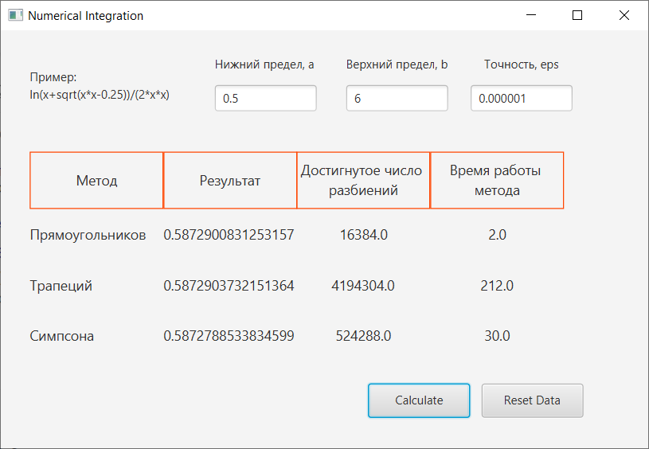

### Алгоритмы и методы вычислений
#### Именование лабораторных работ
Названия проектов имеют следующий формат:  
lab-{Номер лабораторной работы}-{Номер части}-{Название проекта}-[Наличие GUI]  

#### Краткое описание лабораторных работ
##### lab-1-1-AllMethods-GUI
В программе реализованы 3 метода численного интегрирования:
- Метод трапеций
- Метод средних прямоугольников
- Метод Симпсона

Методы находят приближённое значение опредедлённого интеграла с контролем погрешности по формуле Рунге.  

Для нахождения времени работы метода интегрирования используется метод java.lang.System.currentTimeMillis()

##### lab-1-1-Simpson_Algorithm
Реализация метода Симпсона в консольном проекте. Алгоритм тот же, что и в lab-1-1-AllMethods-GUI  

##### lab-1-2-MonteCarloTable-GUI
Программа находит значение определённого интеграла методом Монте-Карло.  

В этой программе мы добавили возможность самим задать количество бросков и серий бросков и увидеть достигнутую точность. Мы также можем сами задать необходимую точность и увидеть, какое количество разбиений потребовалось для её достижения и время работы алгоритма.
Погрешность метода вычисляется в виде стандартного отклонения средних.

##### lab-1-2-MonteCarloChart-GUI
Программа, визуализирующая распределение точек в методе Монте-Карло.  
Количество точек, которые мы "**разбрасываем**" задаётся в коде.

##### lab-2-1-Solution_of_a_linear_system-Gauss-Jordan_method
Находим численное решение СЛАУ с помощью **точного(прямого) метода** исключения Гаусса с выборкой ведущего элемента (метода Гаусса-Жордана, модификация метода Гаусса).  
В программе реализовано исправление "отравленной" матрицы (матрица, где есть строки, у которых коэффициент, лежащий на главной диагонали равен 0)  
**_Подробнее о реализации метода исключения Жордана-Гаусса в [отчёте](https://github.com/VsevolodShengelai/University_Projects/blob/main/Algorithms%20and%20calculation%20methods/%D0%A8%D0%B5%D0%BD%D0%B3%D0%B5%D0%BB%D0%B0%D0%B9%D0%92%D0%9C_%D0%9F%D0%98-201_1_%D0%90%D0%BB%D0%B3%D0%BE%D1%80%D0%B8%D1%82%D0%BC%D1%8B_%D0%9B%D0%A02_2022.docx) по лабораторной работе._**

**Способ исправления отравленной матрицы:**  
Если коэффициент a_nn = 0, мы переставляем местами это уравнение с одним из нижележащих, а именно с тем, у которого коэффициент a_nj не равен 0. Так, мы можем убрать нули с главной диагонали, возникшие уже на каком-то из шагов алгоритма, а не только расположенные на ней изначально.

##### lab-2-1-Solution_of_a_linear_system-Gauss-Seidel_method
Находим численное решение СЛАУ с помощью **итерационного** метода Гаусса-Зейделя.
**_Подробнее о реализации метода Гаусса-Зейделя в [отчёте](https://github.com/VsevolodShengelai/University_Projects/blob/main/Algorithms%20and%20calculation%20methods/%D0%A8%D0%B5%D0%BD%D0%B3%D0%B5%D0%BB%D0%B0%D0%B9%D0%92%D0%9C_%D0%9F%D0%98-201_1_%D0%90%D0%BB%D0%B3%D0%BE%D1%80%D0%B8%D1%82%D0%BC%D1%8B_%D0%9B%D0%A02_2022.docx) по лабораторной работе._**  
Алгоритм исправления отравления строк матрицы тот же, что и в предыдущем проекте.  
Также реализована проверка сходимости итерационного процесса

##### lab-4-1-LagrangePolinom-GUI
Программа реализуюет метод интерполяции табличных значений – полином Лагранжа для глобальной интерполяции.

_Зелёным цветом отмечены точки, для которых находится значение y с помощью пересчёта полинома Лагранжа. При этом они находятся на полиноме Лагранжа, построенном из точек условия (значит, метод интепляции работает правильно)_  
_Можно отобразить и базисные полиномы, но у меня возникла проблема с их визуализацией. Подробнее на [StackOverflow](https://stackoverflow.com/questions/71808518/make-the-markers-on-the-linechart-transparent-javafx)_

##### lab-4-1-LagrangePolinom
В этой консольной программе для проверки работы метода, помимо табличного способа задания исходных данных, реализовано задание исходных данных с помощью функции.

##### lab-7-1-backpack
В этом проекте мы решили задачу комбинаторной оптимизации - задачу о рюкзаке, её вариант Рюкзак 0-1
Задачу решили двумя методами: методом полного перебора и жадным алгоритмом.

