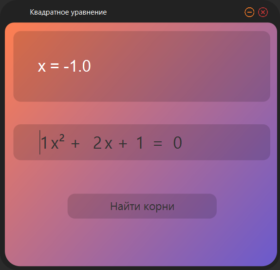
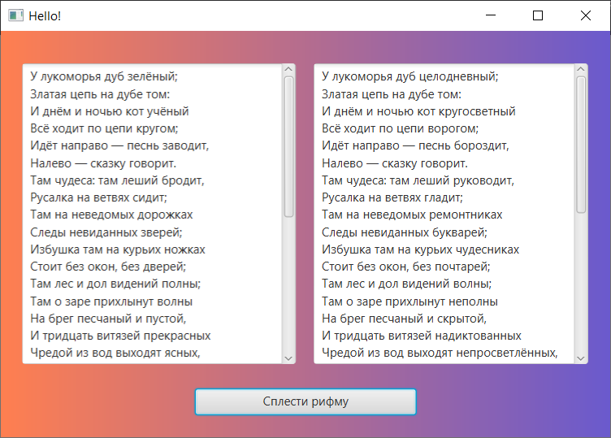
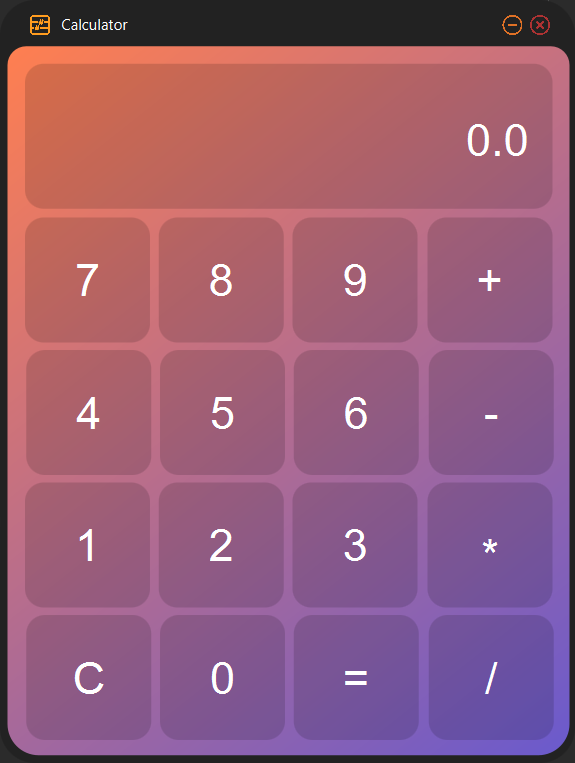

### Разработка и программирование человеко-машинных интерфейсов

### Калькулятор для решения квадратных уравнений
#### Описание
Находит корни квадратного уравнения или сообщает, что таковых нет.  
В зависимости от коэффициентов может вывести в строку ответа следующее:
- Уравнение не имеет решений
- Все коэф-ты равны0, х - любое число
- D<0, действительных корней нет
- x1 = {x1}, x2 = {x2}
- x1 = 0, x2 = {x2}
- x = {x}

  
  
  _Рисунок 1. Графический интерфейс калькулятора для решения квадратных уравнений. Окно приложения имеет скруглённые края_

##### Замечания
Не реализована проверка ввода букв вместо чисел. Для D < 0 можно найти комплексные корни вместо вывода "Действительных корней нет"

### Рифмоплёт
#### Описание
Программа заменяет последнее слово в кадой строке введённого стихотворения "рифмующимя" (совпадающим по последним трём символам) словом.  
Слова берётся из словаря в файле .txt, содержащего полтора миллиона слов

  
_Рисунок 2. Интерфейс Программы "Рифмоплёт"_

##### Замечания
В вводимом тексте нельзя оставлять пустые строки, иначе вылетает ошибка.
Среди слов-кандидатов на "рифму" может попасться заменяемое слово. Нужно реализовать проверку на повторение слов.

### Простой калькулятор
#### Описание
Простой калькулятор, написанный на Java с использованием "платформы" JavaFx 17.0.2
Код калькулятора позаимствован здесь: https://github.com/TheeQBit/SimpleCalculator  
_Я внёс в код изменения для более новой версии Java._ 

  
_Рисунок 3. Графический интерфейс калькулятора. Окно приложения имеет скруглённые края_  

##### Замечания
**Необходимо клонировать чужой репозиторий, добавив его к своему репозиторию (так можно сделать?). Размещённый код - временное решение.**

Необходимо реализовать ввод математического выражения в строку. Пока что калькулятор способен работать с одним бинарным оперратором. Также стоит реализовать возможность ввода действительных чисел.