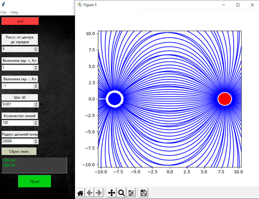

### Основы компьютерного моделирования

### Численное моделирование движения тела, брошенного под углом к горизонту, в среде с сопротивлением
### Описание
Программы строят траекторию движения тела, брошенного под углом к горизонту в прямоугольной системе координат, используя приемы численного интегрирования уравнений Ньютона.
В программах реализованы два алгоритма, учитывающих сопротивление среды:
- [Алгоритм для модели с установившейся скоростью](https://github.com/VsevolodShengelai/University_Projects/blob/main/Fundamentals%20of%20computer%20modeling/Shooting%20at%20an%20angle%20to%20the%20horizon/Release_v2.8%20-%20new%20algorithm_2.py)
- [Алгоритм для модели, в которой величина силы сопротивления пропорциональна скорости тела](https://github.com/VsevolodShengelai/University_Projects/blob/main/Fundamentals%20of%20computer%20modeling/Shooting%20at%20an%20angle%20to%20the%20horizon/Release_v2.8%20-%20new%20algorithm.py) 

На холсте могут быть отображены 5 графиков:
- график зависимости y(x)
- график зависимости скорости от времени
- зависимость модуля ускорения от времени
- зависимость координаты x от t
- зависимость координаты y от t

  

_Рисунок 1. Интерфейс программы с алгоритом для модели с установившейся скоростью_

  
  
_Рисунок 2. Интерфейс программы с алгоритом для модели в которой величина силы сопротивления пропорциональна скорости тела_

### Компьютерное построение линий поля
#### Описание 
Программа строит силовые линии электрического поля для системы из двух разноимённо заряженных точечных зарядов.
В интерфейсе программы мы можем задать:
•	Положение зарядов (чтобы получать картину линий поля, выравненную по горизонтальной линии, мы реализовали эту возможность изменением расстояния между зарядами);
•	Величину положительного и отрицательного зарядов Qpos, Qneg;
•	Шаг приращения dS;
•	Количество линий N;
•	Радиус дальней зоны Rd.
С помощью панели инструментов инструментов для полотна библиотеки matplotlib можно изменить масштаб изображения, сохранить его в файл и перемещаться по полотну. 

  
  
_Рисунок 3. Поле двух разноимённо заряженных точечных зарядов_

